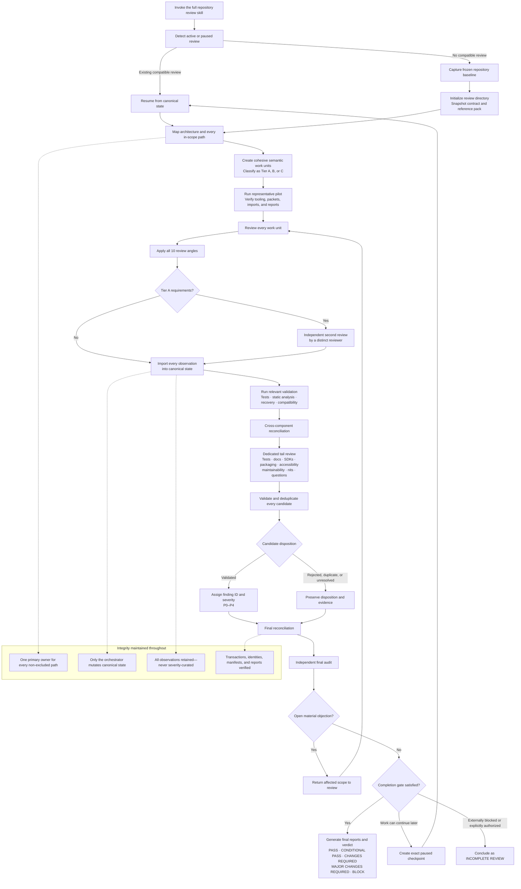

# skill-code-review-full-on-uses-python

An open Agent Skills-format workflow for exhaustive, evidence-backed review of an entire repository.

> **Status:** initial public implementation. The canonical Skill, portable Python state utility, tests, and CI are included; product-specific Plugin packaging is intentionally deferred.

## What “full-on” means

This is not a larger pull-request review. It accounts for every in-scope path, groups code into semantic work units, applies ten review angles, preserves every observation without severity curation, requires independent second review of critical surfaces, runs validation and cross-component reconciliation, protects commonly starved tail categories, and finishes with an independent audit. Large repositories may require multiple specialist waves or honest paused/resumed checkpoints.

The core Skill follows the open Agent Skills directory format. Its `contract.md` and `reference-pack.md` are editable and forkable: they are snapshotted for each review specification epoch, but they are not cryptographically pinned or coupled to a digest manifest. Runtime identities remain where they protect the repository baseline, canonical state, transactions, attempts, validations, deterministic audit sampling, and generated reports.

## How the review works



Every path is accounted for, every work unit receives all ten review angles,
critical surfaces get independent review, and the process cannot issue a
passing verdict until validation and the final audit are reconciled.

## Repository layout

```text
skills/skill-code-review-full-on-uses-python/
├── SKILL.md
├── references/
│   ├── contract.md
│   └── reference-pack.md
└── scripts/
    ├── review-tool
    └── review_tool/
tests/
└── fixtures/
```

Install the entire `skills/skill-code-review-full-on-uses-python/` directory. The Skill has no network or third-party runtime dependency; its bundled utility requires Python 3.11 or newer.

## Installation

Copy or symlink the canonical Skill directory into the appropriate location:

| Client | User installation | Project installation |
|---|---|---|
| Codex | `~/.agents/skills/skill-code-review-full-on-uses-python/` | `.agents/skills/skill-code-review-full-on-uses-python/` |
| Claude Code | `~/.claude/skills/skill-code-review-full-on-uses-python/` | `.claude/skills/skill-code-review-full-on-uses-python/` |
| Gemini CLI | `~/.gemini/skills/skill-code-review-full-on-uses-python/` or `~/.agents/skills/skill-code-review-full-on-uses-python/` | `.gemini/skills/skill-code-review-full-on-uses-python/` or `.agents/skills/skill-code-review-full-on-uses-python/` |
| Cursor | `~/.cursor/skills/skill-code-review-full-on-uses-python/` or `~/.agents/skills/skill-code-review-full-on-uses-python/` | `.cursor/skills/skill-code-review-full-on-uses-python/` or `.agents/skills/skill-code-review-full-on-uses-python/` |

The directory to install is always:

```text
skills/skill-code-review-full-on-uses-python/
```

### Install in Codex from GitHub

Clone the published repository, then symlink the Skill for user-wide use:

```bash
git clone https://github.com/Kevinjohn/skill-code-review-full-on-uses-python.git
mkdir -p ~/.agents/skills
ln -s "$(pwd)/skill-code-review-full-on-uses-python/skills/skill-code-review-full-on-uses-python" \
  ~/.agents/skills/skill-code-review-full-on-uses-python
```

The symlink keeps the installed Skill current after running `git pull` in the
clone. To install an independent copy instead:

```bash
mkdir -p ~/.agents/skills
cp -R skill-code-review-full-on-uses-python/skills/skill-code-review-full-on-uses-python \
  ~/.agents/skills/
```

For a project-local Codex installation, run this from the target repository:

```bash
mkdir -p .agents/skills
cp -R /path/to/skill-code-review-full-on-uses-python/skills/skill-code-review-full-on-uses-python \
  .agents/skills/
```

Codex can also install the published Skill from a prompt:

```text
$skill-installer Install the skill from
https://github.com/Kevinjohn/skill-code-review-full-on-uses-python
using the path skills/skill-code-review-full-on-uses-python
```

Codex scans user and repository `.agents/skills` directories and supports
symlinked Skill folders. See the official
[Codex Skill documentation](https://learn.chatgpt.com/docs/build-skills#where-to-save-skills).
Codex normally detects changes automatically; restart it if the Skill does not
appear in `/skills` or when typing `$`.

### Install in Claude Code

Clone the repository, then symlink the canonical Skill for user-wide use:

```bash
git clone https://github.com/Kevinjohn/skill-code-review-full-on-uses-python.git
mkdir -p ~/.claude/skills
ln -s "$(pwd)/skill-code-review-full-on-uses-python/skills/skill-code-review-full-on-uses-python" \
  ~/.claude/skills/skill-code-review-full-on-uses-python
```

For one project, copy it beneath that repository instead:

```bash
mkdir -p .claude/skills
cp -R /path/to/skill-code-review-full-on-uses-python/skills/skill-code-review-full-on-uses-python \
  .claude/skills/
```

Invoke it as `/skill-code-review-full-on-uses-python`. Claude Code normally detects edits
within an existing skills directory immediately. Restart Claude Code if the
top-level skills directory was created after the session began. See the
official [Claude Code Skills documentation](https://code.claude.com/docs/en/slash-commands).

### Install in Gemini CLI

Gemini CLI recognizes both its native `.gemini/skills` location and the shared
`.agents/skills` location. If the Codex user installation above already exists,
Gemini CLI can use the same files without another copy.

To use Gemini CLI's development link command after cloning this repository:

```bash
gemini skills link ./skill-code-review-full-on-uses-python/skills/skill-code-review-full-on-uses-python
```

For a workspace-only link, start Gemini CLI in the target repository and run:

```text
/skills link /path/to/skill-code-review-full-on-uses-python/skills/skill-code-review-full-on-uses-python --scope workspace
```

Alternatively, copy the directory to `~/.gemini/skills/` for user-wide use or
`.gemini/skills/` for one workspace. Run `/skills list` to confirm discovery
and `/skills reload` after changes. Ask Gemini to use the
`skill-code-review-full-on-uses-python` skill; Gemini requests activation consent before
loading third-party Skill resources. See the official
[Gemini CLI Agent Skills documentation](https://geminicli.com/docs/cli/using-agent-skills/).

### Install in Cursor

Cursor recognizes both `.cursor/skills` and the shared `.agents/skills`
locations. If the Codex installation above already exists, Cursor can use the
same user-wide Skill. For a Cursor-native user installation:

```bash
mkdir -p ~/.cursor/skills
cp -R /path/to/skill-code-review-full-on-uses-python/skills/skill-code-review-full-on-uses-python \
  ~/.cursor/skills/
```

For one project:

```bash
mkdir -p .cursor/skills
cp -R /path/to/skill-code-review-full-on-uses-python/skills/skill-code-review-full-on-uses-python \
  .cursor/skills/
```

Invoke it in Agent chat as `/skill-code-review-full-on-uses-python`, or let Cursor select
it automatically when the request matches the Skill description. See the
official [Cursor Agent Skills documentation](https://cursor.com/docs/skills).

This initial release does not claim marketplace or product-specific Plugin
installation support.

## Invocation

Explicitly request the Skill because it is intentionally narrow:

```text
Codex:  $skill-code-review-full-on-uses-python
Claude: /skill-code-review-full-on-uses-python
Gemini: Use the skill-code-review-full-on-uses-python skill to run a complete repository review.
Cursor: /skill-code-review-full-on-uses-python
```

Example requests:

```text
$skill-code-review-full-on-uses-python Run or resume a complete review of this repository.
/skill-code-review-full-on-uses-python Perform a full-on repository and database review where applicable.
Use the skill-code-review-full-on-uses-python skill to run a complete repository review.
```

Ordinary pull-request, diff-only, quick, severity-limited, and narrow reviews should use a smaller review workflow.

## Review output

Reviews are stored beneath the reviewed repository’s `code-reviews/` directory. `code-reviews/LATEST` points to the current review; canonical JSON/JSONL records remain authoritative, while Markdown reports are regenerated views. A review can remain `active`, pause safely for a later invocation, conclude after the full gate, or conclude through the explicit incomplete-handoff gate.

The utility is self-contained:

```bash
skills/skill-code-review-full-on-uses-python/scripts/review-tool --help
python3 skills/skill-code-review-full-on-uses-python/scripts/review_tool --help
```

It provides `init`, `check`, `mutate`, `import`, `import-audit`, `generate`, and `audit` subcommands.

## Development

Run the dependency-free test suite with:

```bash
python3 -m unittest discover -s tests -p 'test_*.py' -v
```

The tests include local Skill validation, broken-state fixtures, reference extraction, transaction interruption/recovery, and a miniature-repository integration flow. See [CONTRIBUTING.md](CONTRIBUTING.md) for schema and reference-editing expectations and [SECURITY.md](SECURITY.md) for private vulnerability reporting.

## Licence

Released under the [MIT Licence](LICENSE).
